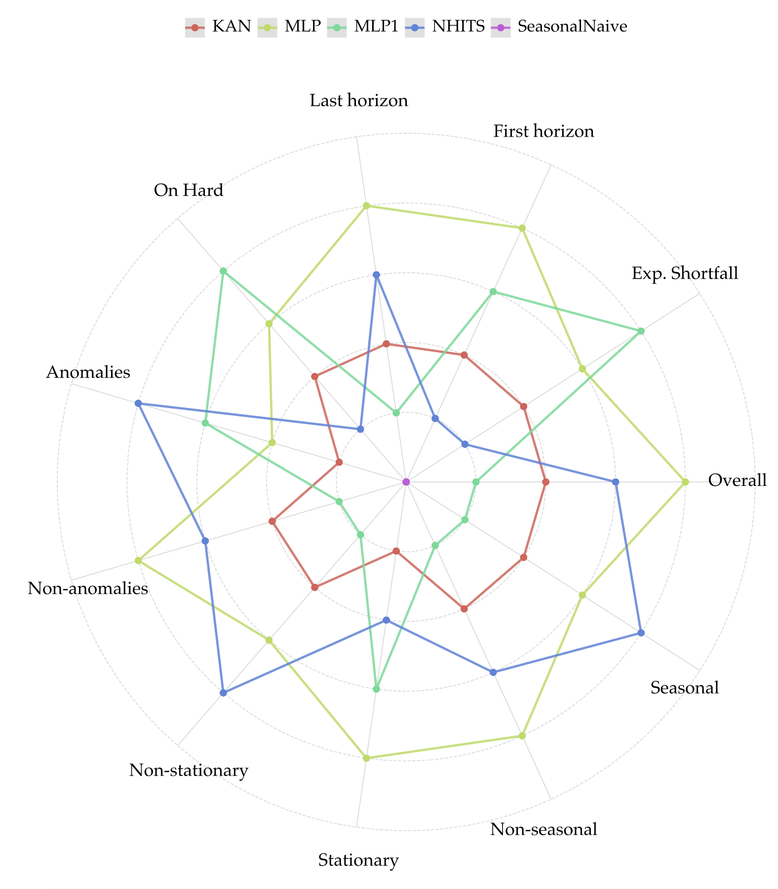
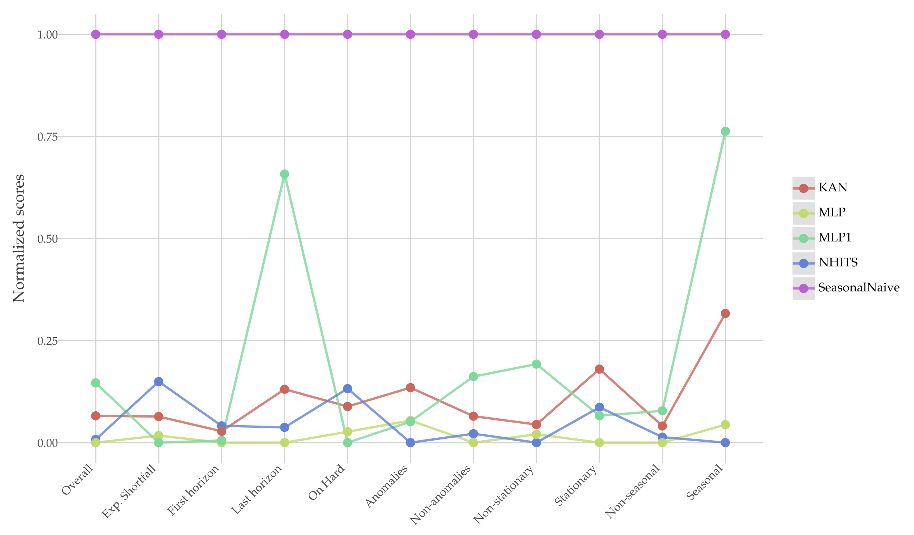

# Model Radar 🎯

A framework for aspect-based evaluation of time series forecasting models based on Nixtla's ecosystem.

[](https://pypi.org/project/modelradar/)
[](https://github.com/vcerqueira/modelradar)
[](https://pepy.tech/project/modelradar)

## Overview

Model Radar introduces a novel aspect-based forecasting evaluation approach that goes beyond traditional aggregate metrics. Our framework enables:
- Fine-grained performance analysis across different forecasting aspects
- Better understanding of model behavior in varying conditions
- More informed model selection based on specific use case requirements

## 🚀 Getting Started

Check the `notebooks` folder for usage examples and tutorials.

Check **[ModelRadar-Experiments](https://github.com/vcerqueira/experiments-modelradar)** repository for a thorough
application of ModelRadar.

## Installation

You can install modelradar using pip:

```bash
pip install modelradar
```

### [Optional] Installation from source

To install modelradar from source, clone the repository and run the following command:

```bash
git clone https://github.com/vcerqueira/modelradar
pip install -e modelradar
```

### Prerequisites

Required dependencies:
```
utilsforecast==0.2.11
numpy==1.26.4
plotnine==0.14.5
```

### Examples

Besides the examples in the `notebooks` folder, here's some outputs you can get from *modelradar*:

- Spider chart with overview on several dimensions:



- Parallel coordinates chart with overview on several dimensions:



- Barplot chart controlling for a given variable (in this case, anomaly status):


- Grouped bar plot showing win/draw/loss ratios wrt different models:


## 📑 References

> Cerqueira, V., Roque, L., & Soares, C. "Forecasting with Deep Learning: Beyond Average of Average of Average Performance." Discovery Science: 27th International Conference, DS 2024, Pisa, Italy, 2024, Proceedings 27. Springer International Publishing, 2024.

Check DS24 folder to reproduce the experiments published on this paper.
The main repository and package contains an updated framework.

### **⚠️ WARNING**

> modelradar is in the early stages of development. 
> The codebase may undergo significant changes. 
> If you encounter any issues, please report
> them in [GitHub Issues](https://github.com/vcerqueira/modelradar/issues)

### Project Funded by

> Agenda “Center for Responsible AI”, nr. C645008882-00000055, investment project nr. 62, financed by the Recovery and Resilience Plan (PRR) and by European Union - NextGeneration EU.
